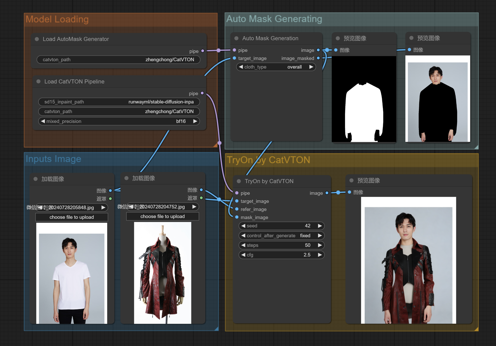

# Comfyui-CatVTON: Concatenation Is All You Need for Virtual Try-On with Diffusion Models

<div style="display: flex; justify-content: center; align-items: center;">
  <a href="http://arxiv.org/abs/2407.15886" style="margin: 0 2px;">
    
  </a>
  <a href='https://huggingface.co/zhengchong/CatVTON' style="margin: 0 2px;">
    
  </a>
  <a href="https://github.com/Zheng-Chong/CatVTON" style="margin: 0 2px;">
    
  </a>
</div>


**Comfyui-CatVTON** This repository is the modified official Comfyui node of CatVTON, which is a simple and efficient virtual try-on diffusion model with 
***1) Lightweight Network (899.06M parameters totally)***, 
***2) Parameter-Efficient Training (49.57M parameters trainable)*** 
***3) Simplified Inference (< 8G VRAM for 1024X768 resolution)***.

The original GitHub project is https://github.com/Zheng-Chong/CatVTON



## Installation
1. git clone https://github.com/pzc163/Comfyui-CatVTON.git under the ComfyUI-aki-v1.3/custom_nodes path or install https://github.com/pzc163/Comfyui-CatVTON.git according to Comfyui Manager with git URL
2. install Detectron2 and DensePose
```PowerShell
pip install git+https://github.com/facebookresearch/detectron2.git@v0.6
pip install git+https://github.com/facebookresearch/detectron2.git@v0.6#subdirectory=projects/DensePose
```
For Windows OS users, if you encounter a compilation and installation failure prompt, you can choose between the following two options
if  python==3.10
Please download Detectron2 and DensePose zip file in the [Releases](https://github.com/pzc163/Comfyui-CatVTON/releases/tag/Detectron2%26densepose), which includes the code placed under /ComfyUI/python/Lib/site-packages of ComfyUI folder path.
Notice that Detectron2 and DensePose zip file was compiled under python==3.10 Cuda==12.1 torch==2.1.2 environment if you can't install Detectron2 and DensePose with the released zip file.
if  python==3.11
Please download Detectron2 and DensePose whl file in the [Releases](https://github.com/pzc163/Comfyui-CatVTON/releases/tag/detectron2-0.6%26densepose-0.6), which includes the wheel file under python==3.11,placed under /ComfyUI/python/Lib/site-packages of ComfyUI folder path.
then open cmd under ./ComfyUI/python/Lib/site-packages/ path
pip install detectron2-0.6-cp311-cp311-win_amd64.whl
pip install detectron2_densepose-0.6-py3-none-any.whl

3. Run the ComfyUI.
4. Download [`catvton_workflow.json`](https://github.com/pzc163/Comfyui-CatVTON/tree/Detectron2%26densepose/workflow/catvton_workflow.json) and drag it into you ComfyUI webpage and enjoy 😆!

When you run the CatVTON workflow for the first time, the weight files will be automatically downloaded, which usually takes dozens of minutes.

If you need to deploy catVTON in a anaconda environment, you can follow the steps below:
An [Installation Guide](https://github.com/Zheng-Chong/CatVTON/blob/main/INSTALL.md) is provided to help build the conda environment for CatVTON. When deploying the app, you will need Detectron2 & DensePose, but these are not required for inference on datasets. Install the packages according to your needs.

## Reference
Our code is modified based on https://github.com/Zheng-Chong/CatVTON

```

